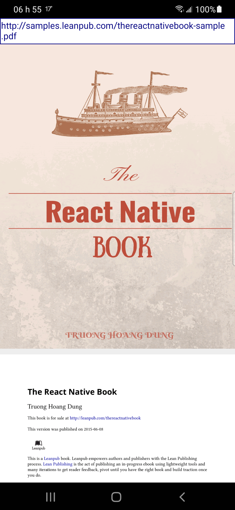
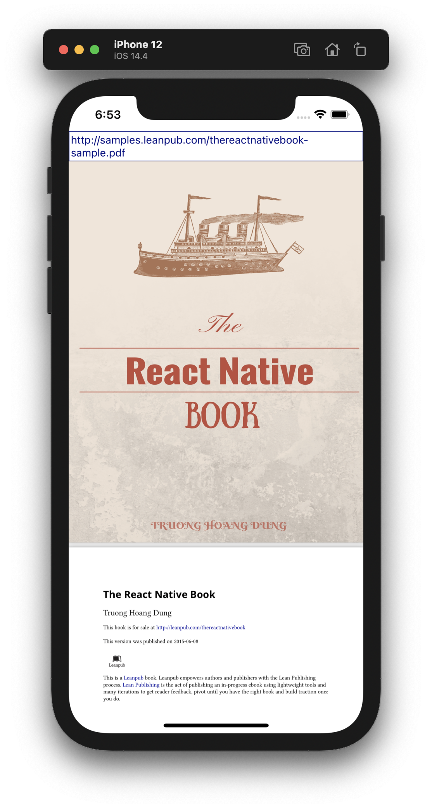

# POC react-native-pdf

POC for iOS and Android - View PDF files natively

  
Android:

  

  
iOS:

  

## Commands

- `yarn start` (starts Metro)
- `yarn run android:dev` (starts app with .env.development configurations)

